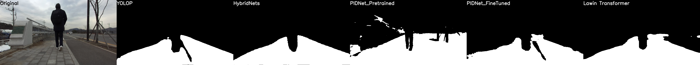
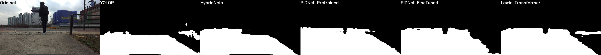
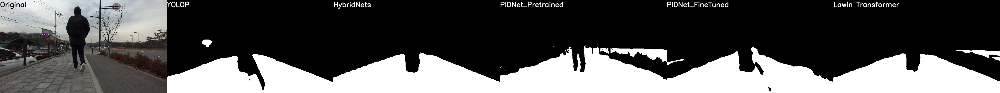
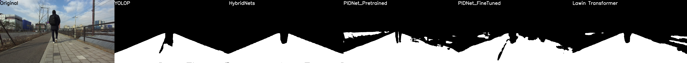

# Road_Segmentation
도로 영역 추출 모듈 연구

다양한 segmentation이 제안되어있고 지표가 측정되어있지만, 주행하고자 하는 거리에 따라 mIOU가 다르게 측정될 수 있고 정량적/정성적인 성능 평가를 해야 하기에 진행

|모델명                                                  |데이터셋|eval 결과 (mIOU)|비고|
|---                                                    |---|---|---|
|[HybridNets](https://github.com/datvuthanh/HybridNets)|/mnt/vitasoft/2021\ 파트라슈\ 레거시/dataset/self_tag/|0.9418|conda env = yolox, half(float16 연산) 적용, fine tuned on [hybridnets.pth](https://github.com/datvuthanh/HybridNets/releases/download/v1.0/hybridnets.pth) |
|[YOLOP](https://github.com/hustvl/YOLOP)|/mnt/vitasoft/2021\ 파트라슈\ 레거시/dataset/self_tag/|0.8894|conda env = owod, morphology 적용한 후 성능 평가, from scratch|
|[Lawin transformer](https://arxiv.org/abs/2201.01615)|/mnt/vitasoft/2021\ 파트라슈\ 레거시/dataset/self_tag/|0.8650|official code release 되기 전. [semantic segmentation](https://github.com/sithu31296/semantic-segmentation)를 참조하여 inference 진행. 약 50ms 의 inference 속도를 가짐(batch_size == 1)|
|[PIDNet-Pretrained](https://github.com/XuJiacong/PIDNet)|cityscapes 데이터셋|0.7549|PIDNet_L_Cityscapes_test.pt 모델이 사용되었으며, Imagenet 데이터셋으로 pretrain 후 cityscapes 데이터셋으로 fine-tuned 됨.|
|[PIDNet](https://github.com/XuJiacong/PIDNet)|/mnt/vitasoft/2021\ 파트라슈\ 레거시/dataset/self_tag/|0.8479|real-time SOTA로 paperswithcode에서 확인, 파트라슈 프로젝트 기준 SOTA X|

성능 평가용 이미지는 비공개이며, 일부만 demo에 공개합니다.

IOU 비교는 검은 배경에 하얀색으로 도로 부분을 마킹하여 저장한 후, [IOU.py](./IOU.py) 를 실행하여 값을 산출 할 수 있습니다.

기타 변수들은 [iou.yaml](./conf/iou.yaml) 파일을 확인하시길 바랍니다

## On Going
N/A

## 성능 비교

  
  
  
  
