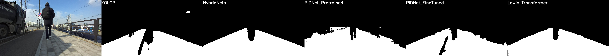

# Road_Segmentation
도로 영역 추출 모듈 연구

다양한 segmentation이 제안되어있고 지표가 측정되어있지만, 주행하고자 하는 거리에 따라 mIOU가 다르게 측정될 수 있고 정량적/정성적인 성능 평가를 해야 하기에 진행


|모델명                                                  |데이터셋|eval 결과 (mIOU)|비고|
|---                                                    |---|---|---|
|[HybridNets](https://github.com/datvuthanh/HybridNets)|/mnt/vitasoft/2021\ 파트라슈\ 레거시/dataset/self_tag/|0.9418|conda env = yolox, half(float16 연산) 적용, fine tuned on [hybridnets.pth](https://github.com/datvuthanh/HybridNets/releases/download/v1.0/hybridnets.pth) |
|[YOLOP](https://github.com/hustvl/YOLOP)|/mnt/vitasoft/2021\ 파트라슈\ 레거시/dataset/self_tag/|0.8894|conda env = owod, morphology 적용한 후 성능 평가, from scratch|
|[Lawin transformer](https://arxiv.org/abs/2201.01615)|/mnt/vitasoft/2021\ 파트라슈\ 레거시/dataset/self_tag/|0.8650|official code release 되기 전. [semantic segmentation](https://github.com/sithu31296/semantic-segmentation)를 참조하여 inference 진행. 약 50ms 의 inference 속도를 가짐(batch_size == 1)|
|[PIDNet-Pretrained](https://github.com/XuJiacong/PIDNet)|cityscapes 데이터셋|0.7549|PIDNet_L_Cityscapes_test.pt 모델이 사용되었으며, Imagenet 데이터셋으로 pretrain 후 cityscapes 데이터셋으로 fine-tuned 됨.|
|[PIDNet](https://github.com/XuJiacong/PIDNet)|/mnt/vitasoft/2021\ 파트라슈\ 레거시/dataset/self_tag/|0.8479|real-time SOTA로 paperswithcode에서 확인, 파트라슈 프로젝트 기준 SOTA X|

성능 평가용 이미지들은 [서버(49.50.163.17)](http://49.50.163.17:8888/lab)에 있는 /home/ubuntu/workspace/ywshin/HybridNets/iou_sample/ 폴더에서 찾아보실 수 있습니다.

IOU 비교는 검은 배경에 하얀색으로 도로 부분을 마킹하여 저장한 후, [IOU.py](./IOU.py) 를 실행하여 값을 산출 할 수 있습니다.

```bash
python IOU.py ori_dir="dir/to/gt_segmentation_result/" pred_dir="dir/to/inference_result"
```

기타 변수들은 [iou.yaml](./conf/iou.yaml) 파일을 확인하시길 바랍니다

## On Going
Lawin Transformer 학습중

backbone: MiT-B5

head: Lawin

pretrained: mit_b5.pth

~~학습에 문제가 있어 (이미지 사이즈, 카테고리 수 등) 수정 진행중~~

### HybridNets

Repository 내 [hybridnets](./hybridnets/) 폴더 내 간략한 inference 코드 작성하여 정리해두었습니다.

```bash
cd hybridnets/
python segmentation_only.py load_weights="path/to/weight" source="dir/to/input/imgs" output="dir/to/save/results"
```

더 자세한 변수들은 [patrasche.yaml](./hybridnets/projects/patrasche.yaml) 에서 확인 바랍니다

### YOLOP

~~[서버(49.50.163.17)](http://49.50.163.17:8888/lab)에 있는 /home/ubuntu/workspace/ywshin/patrasche/YOLOP/yolop_test.ipynb 의 마지막 셀에 rough inference code 작성해두었습니다 (정리 예정)~~

[서버(49.50.163.17)](http://49.50.163.17:8888/lab) 에 있는 /home/ubuntu/workspace/ywshin/patrasche/YOLOP/seg_inference.py 실행 시 inference 가능합니다. argparse 부분 수정하여 source/output/weight 변경 가능 합니다

### Lawin Transformer

~~Lawin transformer 의 official code가 release 되지 않았기에, SegFormer를 먼저 테스트한 후 Lawin transformer의 head 를 끼우는 방식으로 진행. 현재 road에 대해 원하는대로 학습이 되어있지 않아 inference가 올바르게 되지 않음. 추가 학습 필요.~~

backbone: MiT-B5

head: Lawin

pretrained: mit_b5.pth

의 조건으로 fine tune with Lawin head를 진행, 모델을 학습시킴.
단점은 정사각형의 형태로만 학습을 하지만 padding 하는 로직을 제대로 적용하지 못하여 실제 inference를 할 시 비율 고려 없이 width height를 동일하게 하여 inference를 진행함.

또한 용량이 매우 커 512X512 기준 batchxsize 2가 약 12G를 차지하는것으로 확인.

그러나 2208X1242 를 512X512로 강제로 줄여 사용했음에도 mIOU 가 0.8650이라는 아주 높은 수치를 기록했기에 참조할 만한 모델로 판단됨.

추가학습 진행중.


### PIDNet

~~SOTA 모델로 테스트 진행 예정~~

Repository 내 [pidnet](./pidnet/) 폴더 내 간략한 inference 코드 작성하여 정리해두었습니다.

```bash
cd pidnet/
python iou_inf.py
```

해당 코드는 기본 iou 평가를 위해 작성되었으며, 낮은 수치를 기록하여 관련 library 및 코드 정리를 특별히 진행하지 않았습니다.
이외의 요청이 있을시 코드 정리 및 batch inference 가능하게 수정할 예정입니다

## 성능 비교

  
  
  
  
